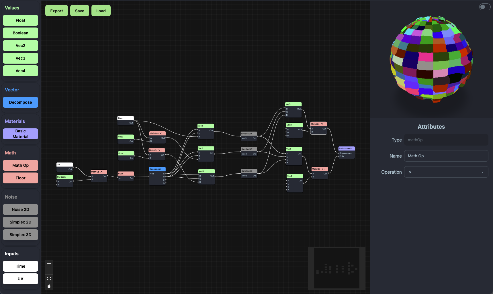

# ShaderPass
A web-based node graph editor for constructing GLSL shaders in real time. Built with React, Zustand, React Flow, and Three.js, this project allows you to visually build vertex and fragment shaders by connecting data nodes and previewing the results on a 3D mesh.



## Features

- **Node Graph UI**: Drag-and-drop nodes, connect edges, and rearrange your graph with React Flow.
- **Real-Time Shader Preview**: Live GLSL shader compilation and rendering on a 3D sphere via Three.js and react-three-fiber.
- **Dynamic Node Types**: Number, String, Math, Vec2/3/4, Noise2D, Time, and custom Shader Output nodes.
- **Attribute Editor**: Edit node parameters (values, operations, enums) with debounced updates.
- **Export State**: Serialize your node graph to JSON for sharing or persistence.

## Getting Started

### Prerequisites

- **Node.js** v18+ and **npm** or **yarn**

### Installation

```bash
npm install
```

### Running the App

```bash
npm run dev
```

Open [http://localhost:5173](http://localhost:5173) in your browser to view the editor.

## Usage

1. **Create Nodes**: Use the sidebar or panel to add nodes (Number, Math, Vec, etc.).
2. **Connect Edges**: Drag handles to connect node outputs to inputs.
3. **Edit Attributes**: Select a node to open the attributes panel and adjust values.
4. **Live Preview**: Watch the sphere update in real time with your shader.
5. **Export**: Click "Export" in the NodeEditor to log the serialized graph JSON.

---
